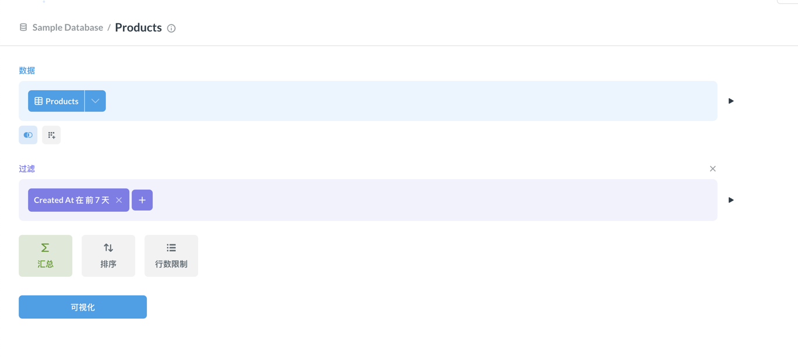
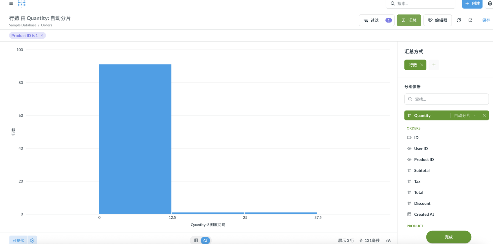
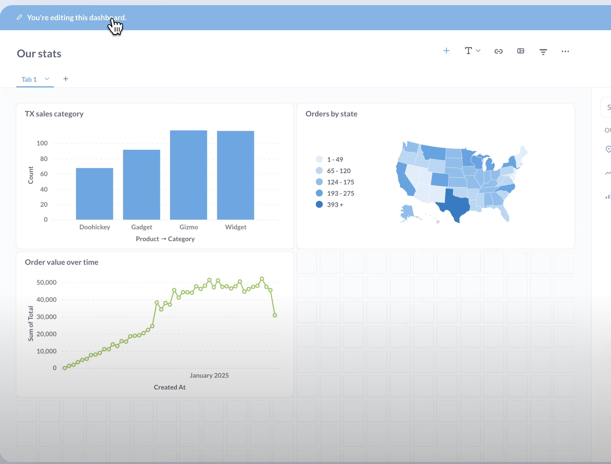
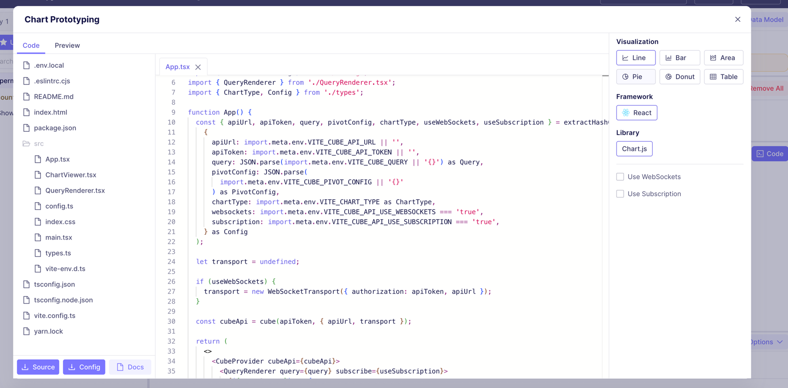
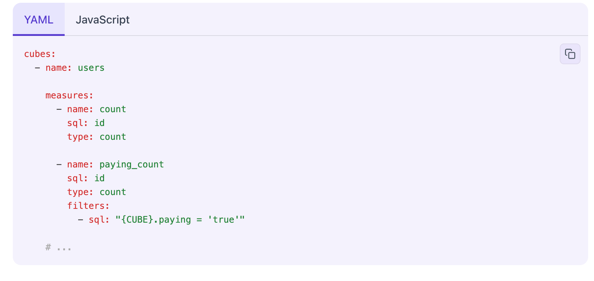
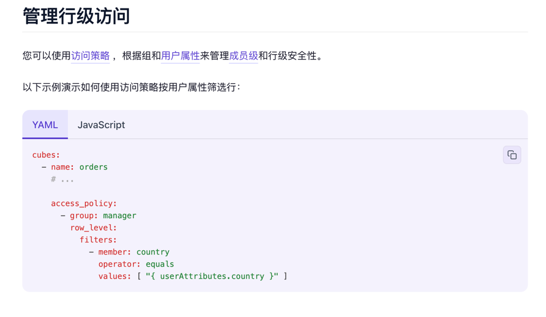
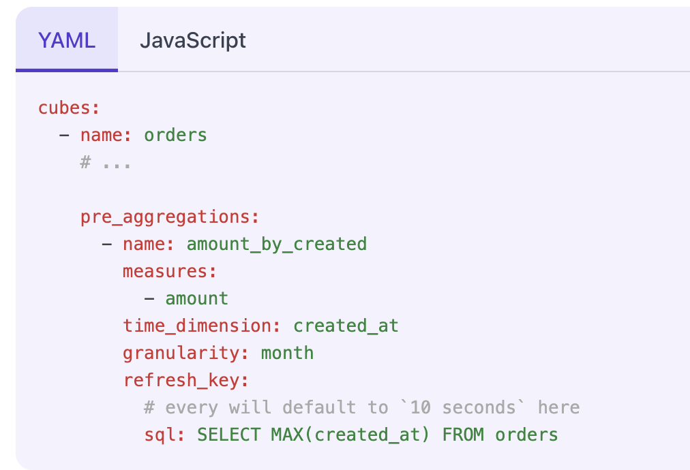

# 个性化自助报表系统调研

## 1. 概述
目标：业务用户零代码自助构建个性化报表，包括字段选择、约束条件、更新方式、预览发布。  
核心价值：统一语义层、元数据模型、DSL配置、缓存命中、物化结果表、增量刷新。  
技术栈：Cube.js + ClickHouse + Airflow + 前端自研(echarts 报表,formilyjs 设计器)。 matbase 企业版，superset 企业版。

- [Cube.js](https://cube.dev/docs/product/introduction)
- [matebase](https://www.metabase.com/)
- [superset](https://superset.apache.org/)
- [echarts](https://echarts.apache.org/ )
- [formilyjs](https://formilyjs.org/zh-CN)
 
## 2.前端功能

### 2.1 数据源连接与配置
- 支持：选择数据源 编辑 连接参数。 选择数据库/模式/表。 等 大多数产品都大同小异。

### 2.2 UI层 设计器
- 大多数等开源框架或者商业应用 设计器 大同小异 都是选表 选字段  配置：过滤 排序 聚合 ，sql编辑窗口 等 功能。
   同样的设计器这部分基本都不开放使用 如果需要嵌入到自己的网站（matebase 升级为企业版）联系对方购买
- cube  
- matebase  

### 2.3 UI层 可视化/报表页面/控制面板（多个图表集合）
- 大多数的框架 都有报表可视化支持多种类型的图表 如：折线图、柱状图、饼图、地图等。但是要嵌入到自己网站里面 要么
  （matebase 升级为企业版 定制化层度更高 前端js sdk模块导入）。
  或者通过ifeam 嵌入到自己的网站 但是有logo。链接支持访问控制比如Authorized Token
- matebase 
- cube.js 开源的管理设计后台支持一键预览图表js代码（一幅图） 。嵌入方案需要升级企业版 

## 3.服务端

### 3.1 语义层(数据模型)
 
  - 语义层：描述如何获取数据的 模型。大多数bi语言层都是 类sql。
  - matebase ，superset 都是基于sql的语义层。 提供 使用查询构建器 提供 连接表，创建自定义列，筛选数据，汇总和分组数据，限制结果。同时也支持原生sql编辑
可以理解为 。 matebase ，superset 就是 提供了 可视化的sqlbuilder 。
  - cube.js 的语义层在sql上又有 抽象。提供了度量（measures），维度（dimensions），时间维度（timeDimensions），计算字段（calculatedMembers）。等概念
   提供yaml 和 js 两种方式定义语义层 .  其中度量，时间维度 是给图表用的 ，维度可以理解为 结果集的列。
  - cube.js 的语法更像是给设计器用的view层的语言 。 
  - 

### 3.2 访问权限控制
  - jwt 认证 基于 jwt 令牌。
  - 数据行级控制 
  - 其他的也大同小异 不过是 版本问题 企业版 和sass版本。sass版本又回 多一个租户级别的访问控制

### 3.3 查询缓存，物化视图
  - cube.js 开源的就 支持查询缓存，物化视图。提供多种刷新策略。
     如图通过配置预聚合 可以在后台自动刷新物化视图。自动创建一张amount_by_created 表 。
  -   定时刷新 every: '1 hour'
  -   增量刷新：设置 partitionGranularity: 'day'/'hour' + refreshRange + incremental 模式（最常用、最省资源）
  -   近实时：every: '5 minute' + 增量分区 
  -   手动刷新：apiCache.invalidate() 或 refreshCubeCache API
  -   Lambda 模式：按需刷新（on-demand），查询时自动构建/刷新过期预聚合
  -   连续刷新：continuousRefresh: true 
  -   matebase 要升级到企业版。

### 3.4 调度 
- 调度：Airflow , Dagster ,Prefect 等
- cube.js 可集成的 Airflow ，Dagster，Prefect 等工具。
- cube.js 集成链接： [Cube.js 与 Airflow 集成](https://cube.dev/docs/product/apis-integrations/orchestration-api/airflow)

### 3.5 api
- cube.js： cube.js是 headless 架构 。提供了查询restful api  ，sql api ， GraphQL API等。 restful api 是 最常用的 根据查询构建语句的参数 得到报表数据。
sql api 是 直接执行sql语句 得到报表数据。可以cube.js 当成一个数据库使用 链接cube服务 执行sql语句。
- matebse api 就比较丰富了 提供了  数据查询，元数据查询，用户管理，控制面板, 数据集管理, 权限管理, 角色管理, 通知管理, 日志管理,警告 等api。

## 4. 总结
- 如果要  高度定制化选cube.js即可 前端自研设计器 和 报表 无缝集成到自有网站。
- 如果需要前后端完全一体直接买 matebase 企业版 即可。
